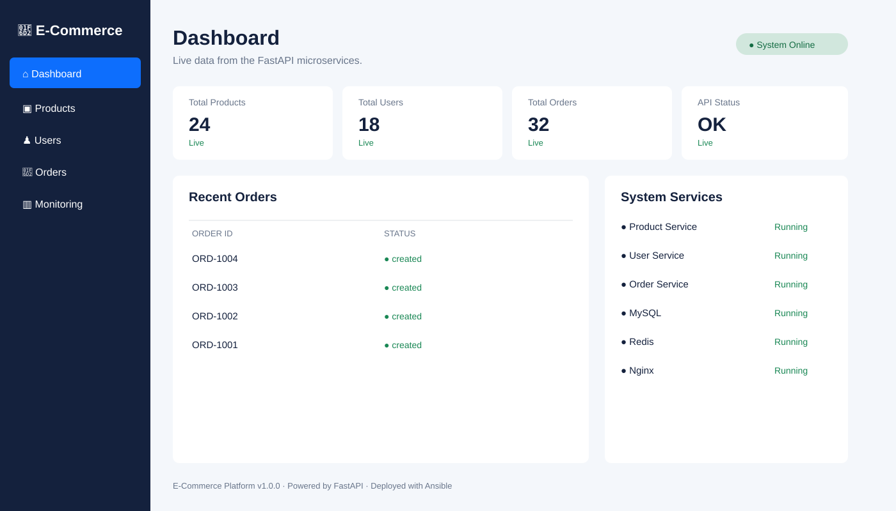

# Ansible Microservices Platform

A practical enterprise-style Ansible project for deploying a small e-commerce platform.

## Architecture

- `product-service` - FastAPI product API
- `user-service` - FastAPI user API
- `order-service` - FastAPI order API
- Nginx reverse proxy
- MySQL database
- Redis cache
- Prometheus + Grafana monitoring
- Bootstrap web UI dashboard

The application is intentionally small so the focus stays on Ansible.

## UI Dashboard

The project now includes a simple responsive Bootstrap dashboard under `ui/index.html`.



The UI is intentionally frontend-only for now, with sample dashboard data. It is ready to be wired to the FastAPI services in a later phase.

To preview it locally, open `ui/index.html` in a browser, or serve the directory with any static web server:

```bash
cd ui
python3 -m http.server 8080
```

Then visit `http://localhost:8080`.

## Repository goals

This repository demonstrates:

- inventories and environment separation
- group_vars / host_vars
- variables, defaults and facts
- roles, role dependencies and handlers
- templates and Jinja2
- loops, conditionals and registered variables
- `changed_when` / `failed_when`
- `become`, tags and check mode
- `delegate_to`, `run_once`, `serial`
- rolling deployments and health checks
- blocks / rescue / always
- Ansible Vault
- Docker deployment
- Prometheus/Grafana configuration
- backups and rollback
- Molecule, ansible-lint and GitHub Actions
- responsive Bootstrap UI

## Quick local application test

```bash
docker compose -f docker-compose.yml up --build
```

Then:

```bash
curl http://localhost:8080/products
curl http://localhost:8080/users
curl http://localhost:8080/orders/health
```

## Ansible

Install the required collections:

```bash
ansible-galaxy collection install -r requirements.yml
```

Validate the repository:

```bash
ansible-playbook -i inventory/dev/hosts.yml playbooks/site.yml --syntax-check
ansible-playbook -i inventory/dev/hosts.yml playbooks/site.yml --check --diff
ansible-lint .
```

> Secrets are represented only by Vault placeholders. Never commit real passwords, API keys, SSH keys or tokens.
